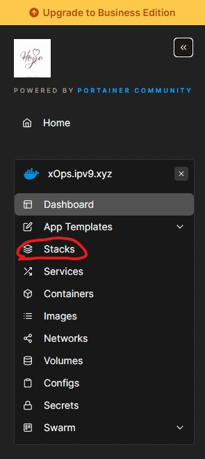
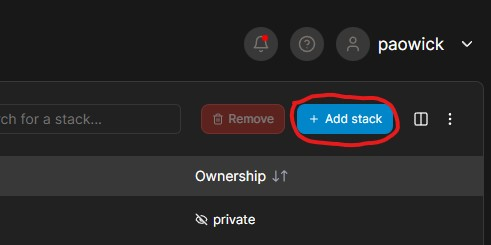
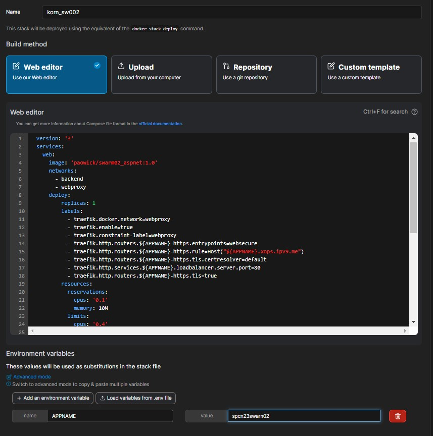
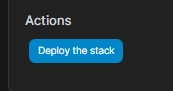
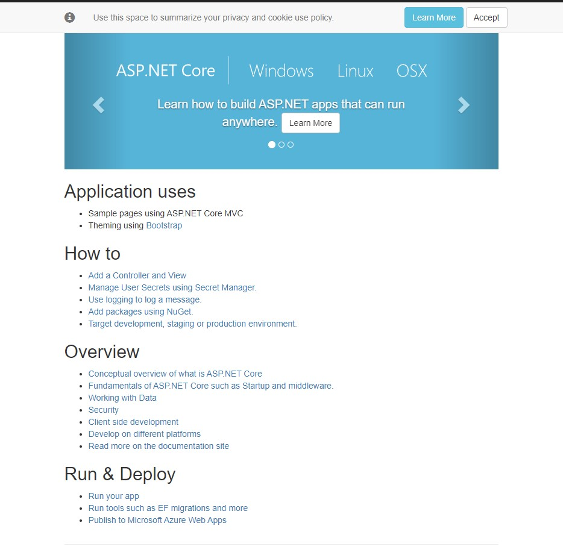

# swarm02

## REF
This repo reference from ***https://github.com/docker/awesome-compose/tree/master/aspnet-mssql***
## Waka time
***https://wakatime.com/@spcn23/projects/dkbwtpywtp***
## Result url
***url https://spcn23swarm02.xops.ipv9.me/***
Project structure:
```
.
├── app
│   ├── aspnetapp
│   │   ├── appsettings.Development.json
|   |   └── ...
│   ├── ...
│   └── Dockerfile
└── docker-compose.yaml
```
[_docker-compose.yaml_](docker-compose.yaml)

```
version: '3'
services:
  web:
    image: 'paowick/swarm02_aspnet:1.0'
    networks: 
      - backend
      - webproxy
    deploy:
        replicas: 1
        labels:
          - traefik.docker.network=webproxy
          - traefik.enable=true
          - traefik.constraint-label=webproxy
          - traefik.http.routers.${APPNAME}-https.entrypoints=websecure
          - traefik.http.routers.${APPNAME}-https.rule=Host("${APPNAME}.xops.ipv9.me")
          - traefik.http.routers.${APPNAME}-https.tls.certresolver=default
          - traefik.http.services.${APPNAME}.loadbalancer.server.port=80
          - traefik.http.routers.${APPNAME}-https.tls=true
        resources:
          reservations:
            cpus: '0.1'
            memory: 10M
          limits:
            cpus: '0.4'
            memory: 250M


  db:
    environment:
      ACCEPT_EULA: "Y"
      SA_PASSWORD: example_123
    # mssql server image isn't available for arm64 architecture, so we use azure-sql instead
    image: mcr.microsoft.com/azure-sql-edge:1.0.4
    # If you really want to use MS SQL Server, uncomment the following line
    #image: mcr.microsoft.com/mssql/server
    networks: 
      - backend
      
networks:
  webproxy:
    external: true
  backend:
    driver: overlay

```
## Step

#### Step  1
&emsp; build image form Dockerfile and push to **Docker Hub**

```
.
├── app
│   ├── aspnetapp
│   │   ├── appsettings.Development.json
|   |   └── ...
│   ├── ...
│   └── Dockerfile  <-- here!!
└── docker-compose.yaml
```
 
&emsp; Dockerfile for build **asp.net** image [_here_](/app/aspnetapp/Dockerfile)
```
# use base imange from  mcr.microsoft.com/dotnet/aspnet version 5.0
FROM mcr.microsoft.com/dotnet/aspnet:5.0 as base

# set work directory at /app
WORKDIR /app

# use image from mcr.microsoft.com/dotnet/sdk versin 5.0
FROM mcr.microsoft.com/dotnet/sdk:5.0 AS build

# copy all of /aspnetapp to /src in image 
COPY . /src

# set work directory at /src and build asp.net app
WORKDIR /src
RUN ls
RUN dotnet build "aspnetapp.csproj" -c Release -o /app/build

# publish app
FROM build AS publish
RUN dotnet publish "aspnetapp.csproj" -c Release -o /app/publish

# run the application
FROM base AS final
WORKDIR /app
COPY --from=publish /app/publish .
ENTRYPOINT ["dotnet", "aspnetapp.dll"]
```
&emsp; build **asp.net** image
```
$docker build ./app/aspnetapp -t paowick/swarm02_aspnet:1.0
```
&emsp; before push the image must be login docker account first ``` $docker login ```\
&emsp; push image to **Docker Hub**
```
$docker push paowick/swarm02_aspnet:1.0
```
#### Step 2
&emsp; Config docker-compose for support traefix and pull image from docker hub\
&emsp; replace ```image: 'paowick/swarm02_aspnet:1.0'``` to service
```
services:
  web:
    image: 'paowick/swarm02_aspnet:1.0'  <--- here
    networks: 
      - backend
      - webproxy
```
&emsp; config label revert Proxy (traefix) reference from [_here_](https://github.com/pitimon/Hello0910/blob/main/docker-compose.yml)\
&emsp; must be look like this
```
     - webproxy
    deploy:
        replicas: 1
        labels:
          - traefik.docker.network=webproxy
          - traefik.enable=true
          - traefik.constraint-label=webproxy
          - traefik.http.routers.${APPNAME}-https.entrypoints=websecure
          - traefik.http.routers.${APPNAME}-https.rule=Host("${APPNAME}.xops.ipv9.me")
          - traefik.http.routers.${APPNAME}-https.tls.certresolver=default
          - traefik.http.services.${APPNAME}.loadbalancer.server.port=80
          - traefik.http.routers.${APPNAME}-https.tls=true
        resources:
          reservations:
            cpus: '0.1'
            memory: 10M
          limits:
            cpus: '0.4'
            memory: 250M

...

networks:
  webproxy:
    external: true
  backend:
    driver: overlay
```

#### Step 3
&emsp; Deploy to https://portainer.ipv9.me/\
- open [_portainer_](https://portainer.ipv9.me/) select **Stack menu**  \

- select Add Stack

- Copy Scripts inside [_docker-compose.yaml_](docker-compose.yaml) file insert them in Web editor Text box Entry Stack name and set your enviroment variable "APPNAME" or you can change by yourself in scripts

- and then deploy

# Result 
&emsp; Url after deploy https://spcn23swarm02.xops.ipv9.me/\

